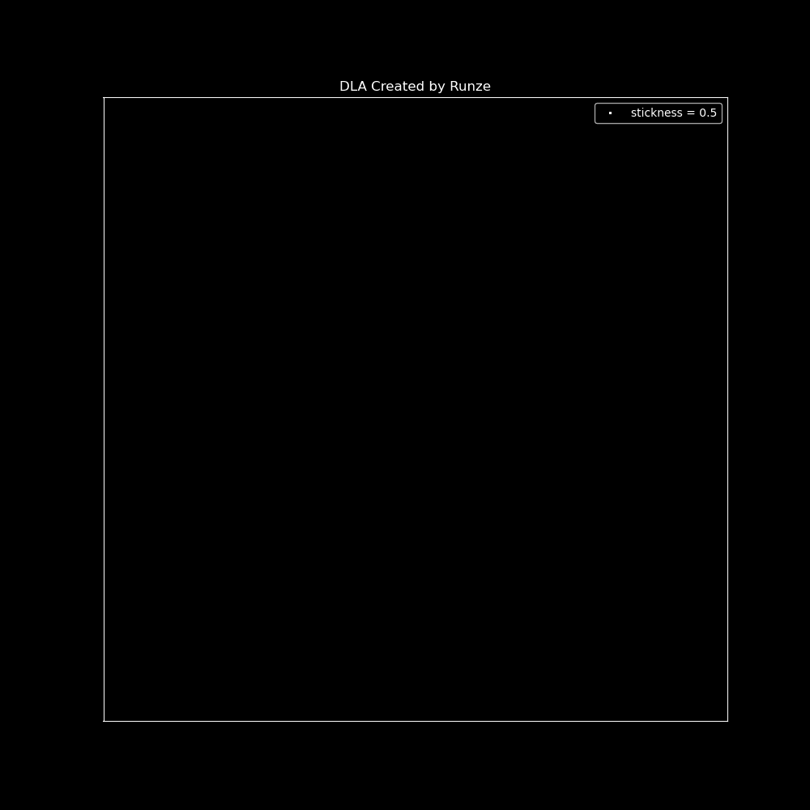
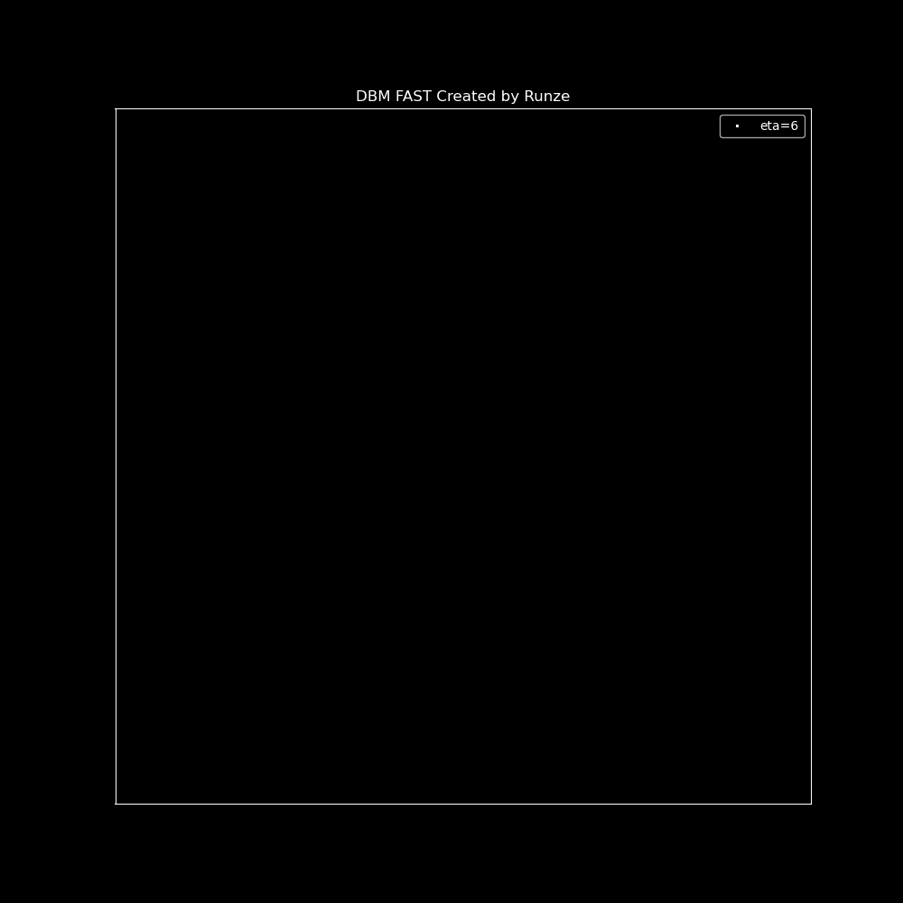

# README

This project mainly discusses the use of random walk algorithm to generate non-equilibrium growth images, which mainly includes DLA model and DBM model, and focuses on the analysis of fractal and fractal characteristics of DLA images. If you want to learn more about the details of DLA and DBM implementation, you can visit my [website](https://rainzor.github.io/growth-model).

## DLA Demo

  

## DBM Fast Demo

  

